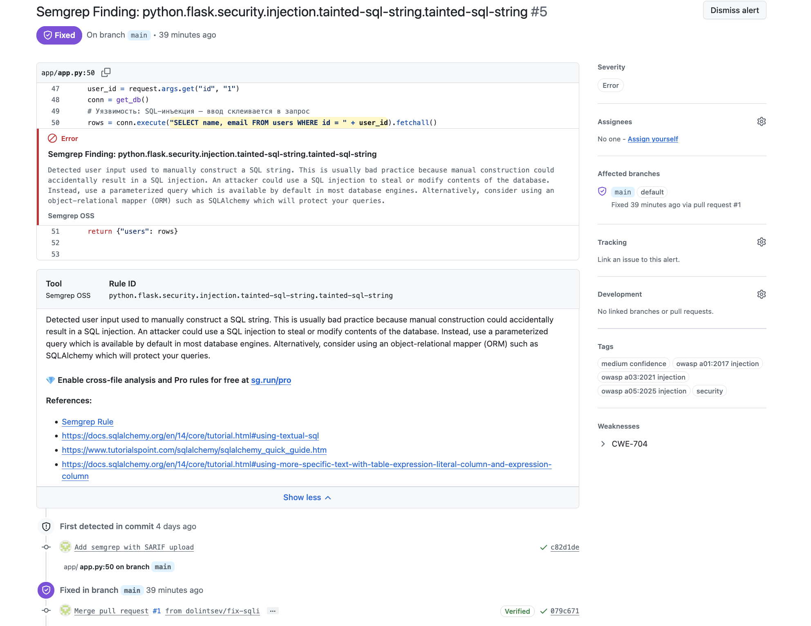
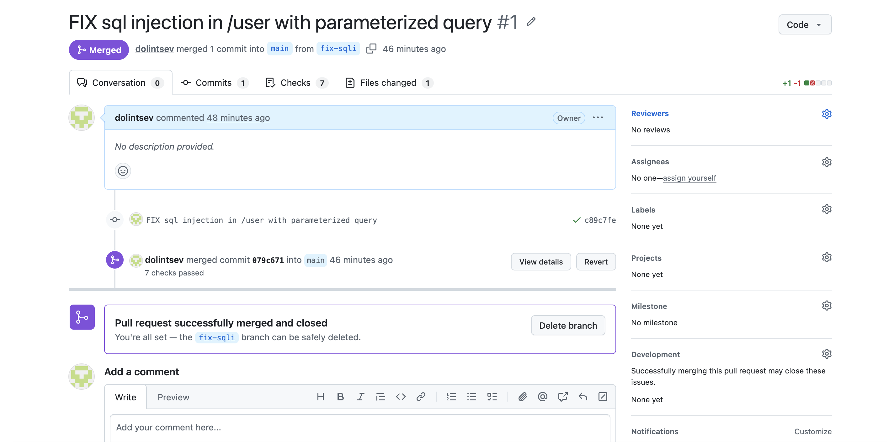
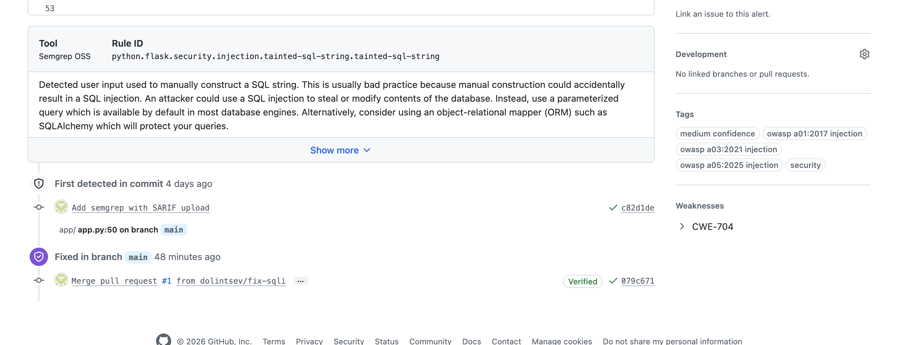
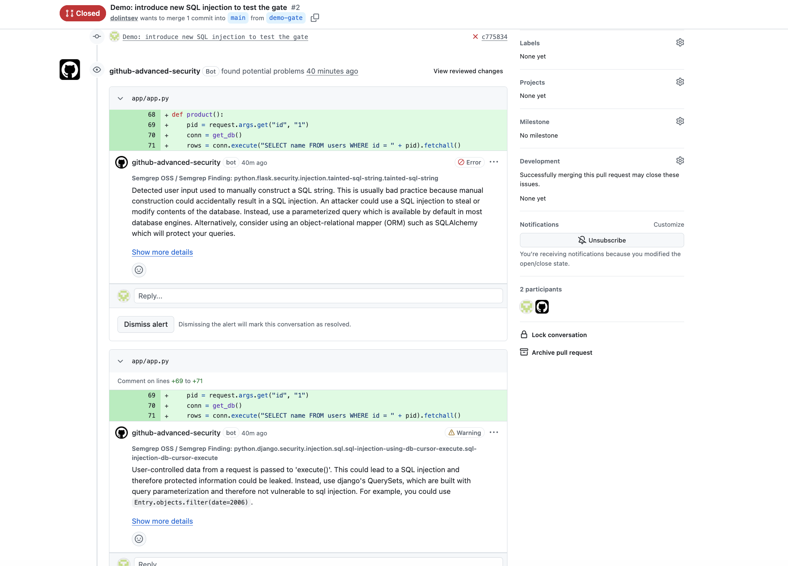

# appsec-pipeline


A DevSecOps pipeline on GitHub Actions that scans an intentionally vulnerable Flask app with SAST, SCA, SBOM, container and DAST tools, publishes every result as SARIF to **Security → Code scanning**, and blocks pull requests that introduce new high-risk issues.

> ⚠️ The app in `app/` is **intentionally vulnerable** and exists for training only. Do not deploy it to an open network.

## Pipeline

```
push to main · pull request · nightly schedule · manual run
  │
  ├── semgrep ── SAST on source code ─────────────────────────────► SARIF
  │               PR gate: new findings only (--baseline-commit)
  │
  ├── image
  │     ├── docker build ─ the artifact that would ship
  │     ├── Syft ──────── SBOM of the built image (CycloneDX) ────► artifact
  │     ├── Trivy ─────── vulnerabilities from the SBOM ──────────► SARIF
  │     ├── Trivy ─────── Dockerfile misconfigurations ───────────► SARIF
  │     └── gate ──────── new fixable CRITICAL/HIGH → fail
  │
  └── dast
        ├── docker run ── app on localhost:5000 (fails if it never starts)
        ├── Nuclei ────── custom template ──┐
        └── Dastardly ─── crawl and attack ─┴─ to_sarif.py ───────► SARIF
                                                                     │
                                         GitHub Security tab ◄───────┘
```

`semgrep`, `image` and `dast` run in parallel.

## Triggers and gates

| Trigger | Why |
|---|---|
| `pull_request` to `main` | Check changes **before** they are merged; branch protection blocks the merge if a gate fails |
| `push` to `main` | Refresh results after merge, so fixed findings are closed automatically |
| `schedule` (03:00 UTC nightly) | New CVEs appear without code changes |
| `workflow_dispatch` | Manual run |

| Gate | Fails when |
|---|---|
| Semgrep | A PR adds a **new** finding compared to its base commit (`--baseline-commit … --error`); existing findings do not block unrelated PRs |
| Trivy | The image has a **new** fixable CRITICAL or HIGH vulnerability not listed in `security/trivy-accepted.txt` |

## Tools

| Stage | Tool | What it checks | Code scanning category |
|---|---|---|---|
| SAST | [Semgrep](https://semgrep.dev) | Source code | `semgrep` |
| SBOM | [Syft](https://github.com/anchore/syft) | Built Docker image | — (artifact `sbom`) |
| SCA | [Trivy](https://trivy.dev) | Packages from the image SBOM | `trivy-sbom` |
| Config | Trivy | Dockerfile | `trivy-config` |
| DAST | [Nuclei](https://github.com/projectdiscovery/nuclei) | Known weaknesses via a custom template | `nuclei` |
| DAST | [Dastardly](https://portswigger.net/burp/dastardly) | Crawling and active checks | `dastardly` |

## Planted vulnerabilities

| Location | Vulnerability | Expected detector | Found |
|---|---|---|---|
| `app.py:13–14` | Hardcoded secret key and password | Semgrep | ❌ missed — `p/secrets` matches known token formats, not arbitrary strings |
| `/search` (`app.py:42`) | Reflected XSS | Semgrep, Dastardly | ✅ Semgrep (3 rules) and ✅ Dastardly |
| `/user` (`app.py:50`) | SQL injection | Semgrep | ✅ `tainted-sql-string` — fixed via PR, alert closed |
| `/ping` (`app.py:58`) | Command injection (`shell=True`) | Semgrep | ✅ 3 rules |
| `/debug` | Exposed page with secrets | Nuclei | ✅ custom template |
| `app.py:70` | Flask debug mode | Semgrep | ✅ `debug-enabled` |
| `requirements.txt` | Outdated libraries with known CVEs | Syft + Trivy | ✅ Flask, Werkzeug, Jinja2, requests, PyYAML (incl. CVE-2020-14343) |
| `Dockerfile` | Outdated base image, runs as root | Trivy | ✅ DS-0002 (root user) and 89 OS-package alerts from the base image |

## Results

| Tool | Open alerts | Notes |
|---|---|---|
| Semgrep | 11 | XSS (`:42`, `:59`), command injection (`:58`), debug mode and `0.0.0.0` (`:70`); several rules often fire on one line |
| Trivy (SBOM) | 129 | 89 in Debian packages of the base image, 40 in Python packages, including transitive ones |
| Trivy (Dockerfile) | 2 | DS-0002 container runs as root, DS-0026 no `HEALTHCHECK` |
| Nuclei | 1 | `/debug` exposes the secret key and admin password |
| Dastardly | 1 | Reflected XSS |

Counts are open alerts after the SQL injection fix.

### Observations

- **Duplicates.** The command injection at `app.py:58` produced three Semgrep alerts from three different rules. Without deduplication (e.g. in DefectDojo) the alert count overstates the number of real issues.
- **Finding beyond the answer key.** Semgrep flagged XSS at `app.py:59`: the output of `ping` is returned as HTML without escaping. It was not in the planted list.
- **False positive.** `avoid_app_run_with_bad_host` (`0.0.0.0`, `app.py:70`): inside a container, listening on all interfaces is required; exposure is controlled by port publishing.
- **SBOM from the artifact.** A directory SBOM built from `requirements.txt` lists only 5 direct dependencies. The SBOM of the built image adds transitive dependencies (`urllib3` and `idna` via `requests`), tools shipped with the base image (`pip`, `setuptools`, `wheel`) and 89 vulnerable OS-package findings — none of which a directory scan sees.
- **Missed secret.** No tool flagged `SECRET_KEY = "super-secret-key-12345"`: `p/secrets` looks for known token formats (AWS keys, GitHub tokens), not arbitrary strings. A custom Semgrep rule or a secret scanner with entropy checks would be needed.
- **DAST complements SAST.** Nuclei confirmed that `/debug` is reachable and leaks secrets — something no static tool reported. Dastardly confirmed the reflected XSS that Semgrep found in code, proving it is exploitable at runtime. Dastardly did not detect the SQL or command injection: its check set is limited by design for fast CI runs.

## Finding lifecycle

How one finding moves from detection to closure:

1. **Detected** — Semgrep raised `tainted-sql-string` at `app/app.py:50` (SQL injection in `/user`).
   
2. **Fixed in a branch** — the query was rewritten with a parameter placeholder:
   ```python
   rows = conn.execute("SELECT name, email FROM users WHERE id = ?", (user_id,)).fetchall()
   ```
3. **Checked in a PR** — the pipeline ran on the pull request; all gates passed. [PR #1](https://github.com/dolintsev/appsec-pipeline/pull/1)
   
4. **Merged and closed** — after merge the scan on `main` no longer reported the issue and GitHub closed the alert as *Fixed*.
   
5. **Gate in action** — a PR that introduced a new SQL injection in `/product` was blocked by the Semgrep gate and closed without merging. [PR #2](https://github.com/dolintsev/appsec-pipeline/pull/2)
   

## Supply chain hardening

- GitHub Actions are pinned to full commit SHAs (version in a comment), not mutable tags like `@v4`.
- Docker images are pinned by `sha256` digest instead of `:latest`; Semgrep is pinned to an exact version.
- `scripts/pin-versions.sh` resolves current SHAs and digests and writes them into the workflow.
- Workflow permissions are minimal: `contents: read`, `security-events: write`.

## No silent failures

A crashed scanner must not look like a clean result:

- Nuclei and Dastardly run without `continue-on-error`.
- Dastardly exits non-zero both on findings and on crashes, so the step checks that a report was produced; no report fails the job.
- `scripts/to_sarif.py` fails if a report is missing or malformed instead of uploading an empty SARIF.
- The DAST job fails if the app never starts.

## Accepted risk

The app is vulnerable on purpose, so existing CVEs in the base image and pinned libraries are listed in `security/trivy-accepted.txt` with a justification. The Trivy gate ignores them and fails only on new ones. Full results are still uploaded to the Security tab.

## Limitations

- GitHub code scanning requires a file location for every result. DAST findings belong to URLs, so `to_sarif.py` anchors them to `app/app.py` and puts the URL in the message.
- Dastardly does not produce SARIF; its JUnit XML is converted by the script.
- The Trivy gate ignores unfixed vulnerabilities (`--ignore-unfixed`) to keep it actionable.

## Repository structure

```
appsec-pipeline/
├── .github/workflows/security.yml   # pipeline
├── app/
│   ├── app.py                       # intentionally vulnerable Flask app
│   ├── requirements.txt             # outdated dependencies
│   └── Dockerfile
├── nuclei/
│   └── debug-exposure.yaml          # custom Nuclei template
├── scripts/
│   ├── to_sarif.py                  # Nuclei JSONL / Dastardly JUnit → SARIF
│   └── pin-versions.sh              # pins actions and images
└── security/
    └── trivy-accepted.txt           # accepted risk for the Trivy gate
```

## Run the app locally

```bash
cd app
docker build -t vuln-shop .
docker run --rm -p 5000:5000 vuln-shop
```

The app listens on `http://localhost:5000`.
